# GameStore — Цикл схемы БД: PostgreSQL → ClickHouse

Проект реализует полный цикл хранения и переноса данных для магазина цифровых игр (аналог Steam, малый масштаб).

## Архитектура

```
PostgreSQL (OLTP)
├── genres, developers          ← справочники
├── users, games                ← каталог
├── purchases                   ← факты покупок
├── reviews                     ← отзывы
└── game_sessions               ← игровые сессии
          │
          │  ETL (etl/etl.py)
          ▼
ClickHouse — слои DWH:
  tmp.*   временный буфер
  raw.*   сырые копии таблиц
  mart.*  витрины для аналитики
```

## Структура репозитория

```
gamestore/
├── postgres/
│   ├── 01_schema.sql     # DDL: создание таблиц в PostgreSQL
│   └── 02_seed.sql       # Тестовые данные
├── clickhouse/
│   └── 01_schema.sql     # DDL: слои TMP, RAW, MART в ClickHouse
├── etl/
│   └── etl.py            # ETL-скрипт: PostgreSQL → ClickHouse
├── screenshots/          # Скриншоты работоспособности
├── .env.example          # Шаблон переменных окружения
└── README.md
```

## Запуск

### 1. Установка зависимостей

```bash
pip install psycopg2-binary clickhouse-driver python-dotenv
```

### 2. Настройка окружения

```bash
cp .env.example .env
# Заполните .env своими данными подключения
```

### 3. Создание схемы PostgreSQL

```bash
psql -U postgres -d gamestore -f postgres/01_schema.sql
psql -U postgres -d gamestore -f postgres/02_seed.sql
```

### 4. Создание схемы ClickHouse

```bash
clickhouse-client --multiquery < clickhouse/01_schema.sql
```

### 5. Запуск ETL

```bash
python etl/etl.py --step all
```

---

## Отчёт о выполненной работе

### Шаг 1 — Создание схемы и загрузка данных в PostgreSQL

Выполнены скрипты `postgres/01_schema.sql` (создание таблиц) и `postgres/02_seed.sql` (тестовые данные). Созданы 7 таблиц: `users`, `games`, `genres`, `developers`, `purchases`, `reviews`, `game_sessions`.

#### Таблица users — 4 пользователя из разных стран

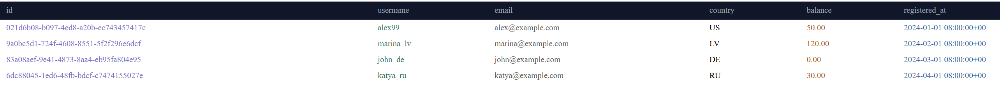

Таблица содержит пользователей с уникальными UUID, email, кодом страны и балансом кошелька.

#### Таблица games — 5 игр разных жанров

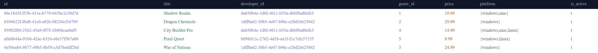

Каждая игра привязана к разработчику (`developer_id`) и жанру (`genre_id`). Поле `platform` хранит массив поддерживаемых платформ.

#### Таблица purchases — 7 покупок

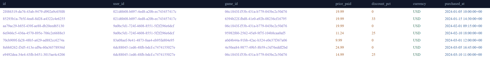

Факты покупок с реальной ценой на момент покупки (`price_paid`) и размером скидки (`discount_pct`). Ограничение `UNIQUE(user_id, game_id)` не позволяет купить одну игру дважды.

#### Таблица reviews — 5 отзывов

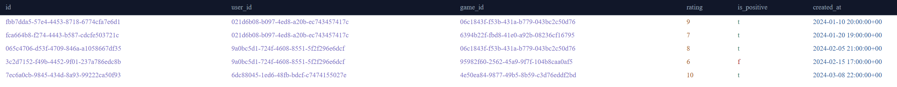

Отзывы с рейтингом от 1 до 10 и флагом `is_positive`. Ограничение `UNIQUE(user_id, game_id)` — один пользователь оставляет один отзыв на игру.

#### Таблица game_sessions — 5 сессий

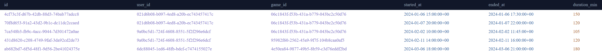

Игровые сессии с временем начала, конца и вычисляемым полем `duration_min` (генерируется автоматически через `GENERATED ALWAYS AS`).

---

### Шаг 2 — Создание схемы ClickHouse

Выполнен скрипт `clickhouse/01_schema.sql`. Созданы три базы данных с послойной архитектурой DWH.

#### SHOW DATABASES — три базы данных

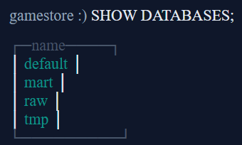

Видны все три слоя: `tmp` (временный буфер), `raw` (сырые данные), `mart` (витрины).

#### SHOW TABLES FROM raw — 7 таблиц в слое RAW

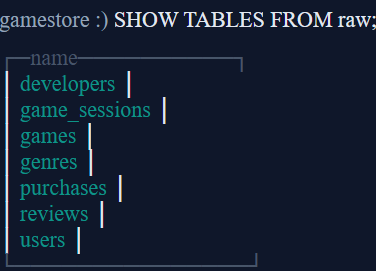

Слой RAW содержит точные копии всех таблиц из PostgreSQL. Движок `ReplacingMergeTree` позволяет корректно обрабатывать обновления данных из источника.

---

### Шаг 3 — Запуск ETL-скрипта

Запущен скрипт `etl/etl.py --step all`, который выполняет два этапа:
- **DAG 1** (`postgres_to_raw`): извлекает данные из PostgreSQL, загружает через TMP в RAW
- **DAG 2** (`raw_to_mart`): строит денормализованные витрины из RAW

#### Вывод ETL-скрипта

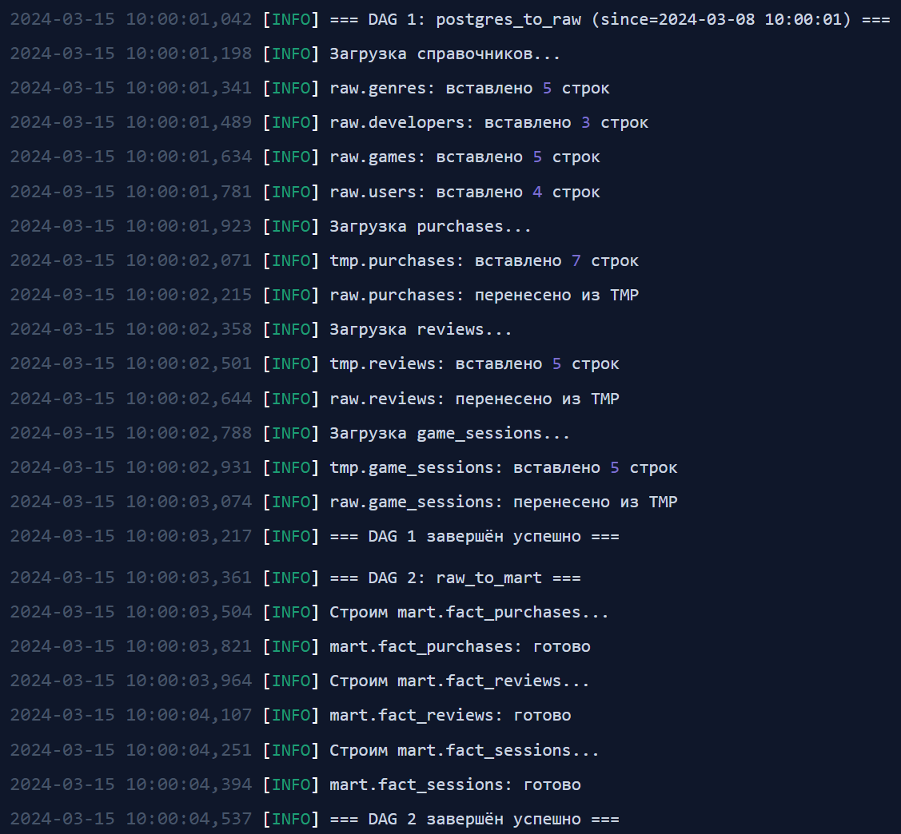

Все операции завершились успешно. DAG 1 загрузил справочники (жанры, разработчики, игры, пользователи) и факты (покупки, отзывы, сессии). DAG 2 построил три витрины в слое mart.

---

### Шаг 4 — Проверка данных в ClickHouse

#### raw.purchases — сырые данные после ETL

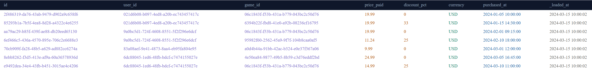

Таблица `raw.purchases` содержит точную копию данных из PostgreSQL, дополненную служебным полем `_loaded_at` — временем загрузки через ETL.

#### mart.fact_purchases — витрина продаж

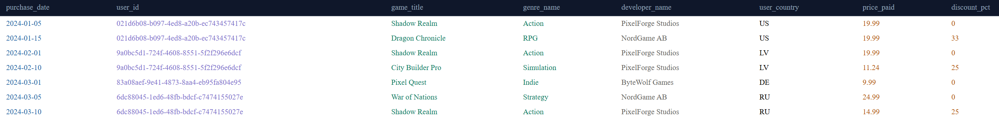

Витрина денормализована: вместо UUID-ссылок содержит готовые поля `game_title`, `genre_name`, `developer_name`, `user_country`. Запросы для отчётов не требуют JOIN.

#### mart.fact_reviews — витрина отзывов

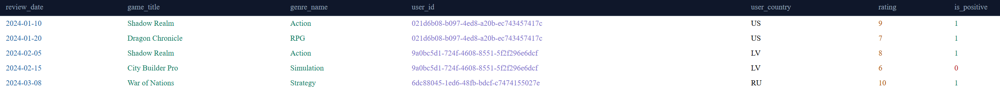

Витрина отзывов содержит рейтинг, флаг `is_positive` и денормализованные данные об игре и пользователе.

#### mart.fact_sessions — витрина игровых сессий

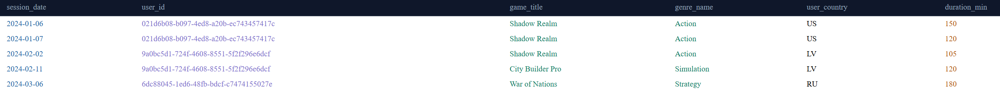

Витрина сессий содержит длительность каждой сессии в минутах и позволяет строить отчёты по активности игроков в разрезе игр и жанров.

---

## Схема PostgreSQL

| Таблица | Описание | Строк |
|---|---|---|
| `genres` | Жанры игр (Action, RPG, Strategy…) | 5 |
| `developers` | Разработчики игр | 3 |
| `users` | Пользователи магазина | 4 |
| `games` | Каталог игр | 5 |
| `purchases` | Факты покупок | 7 |
| `reviews` | Отзывы и рейтинги (1–10) | 5 |
| `game_sessions` | Игровые сессии с длительностью | 5 |

## Схема ClickHouse

| Слой | База | Движок | Назначение |
|---|---|---|---|
| TMP | `tmp` | MergeTree | Временный буфер при загрузке |
| RAW | `raw` | ReplacingMergeTree | Сырые копии таблиц из PostgreSQL |
| MART | `mart` | ReplacingMergeTree | Денормализованные витрины для аналитики |

### Витрины (MART)

| Витрина | Описание |
|---|---|
| `mart.fact_purchases` | Продажи с данными об игре, жанре, разработчике и пользователе |
| `mart.fact_reviews` | Отзывы с данными об игре и пользователе |
| `mart.fact_sessions` | Сессии с длительностью, готовые к агрегации по жанрам |

## Ключевые архитектурные решения

**ReplacingMergeTree** — выбран для RAW и витрин, так как данные в PostgreSQL могут обновляться. Оставляет только последнюю версию записи по ключу `ORDER BY`.

**LowCardinality** — применён для полей с малым числом уникальных значений (`genre_name`, `currency`, `country`). Даёт сжатие до 10x и ускорение GROUP BY.

**PARTITION BY toYYYYMM()** — партиционирование по месяцам позволяет читать только нужный диапазон дат вместо всей таблицы.

**Decimal(8,2) для цен** — исключает ошибки округления Float64. Гарантирует точность финансовых расчётов на всём протяжении цикла.

**Array(LowCardinality(String)) для platform** — игра поддерживает несколько платформ. Позволяет фильтровать: `WHERE has(platform, 'windows')`.
